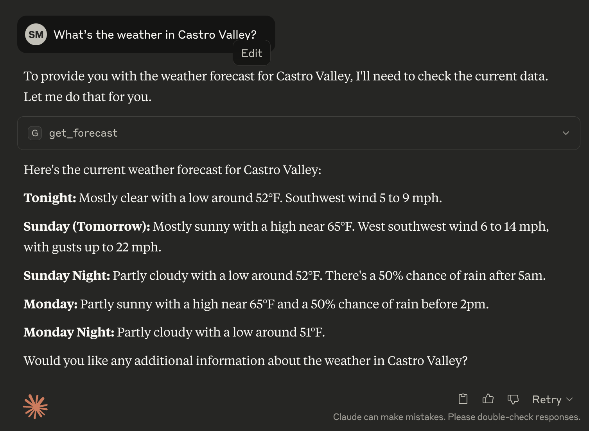
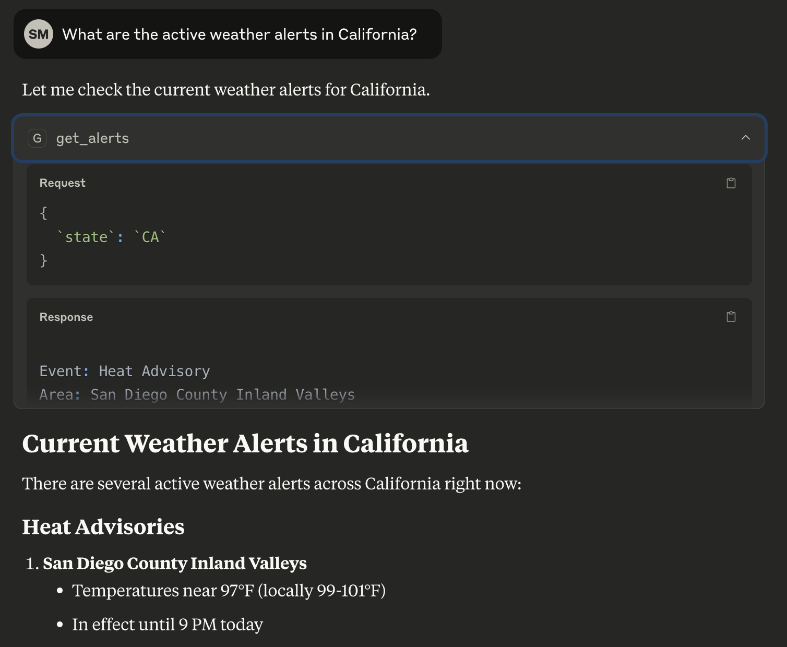
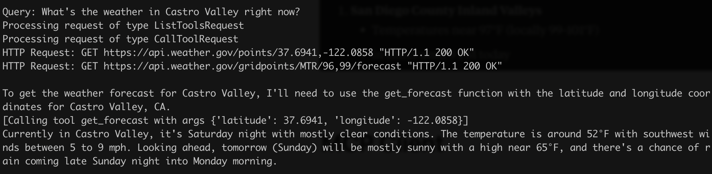
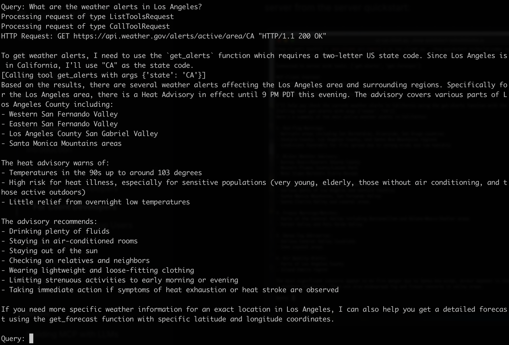
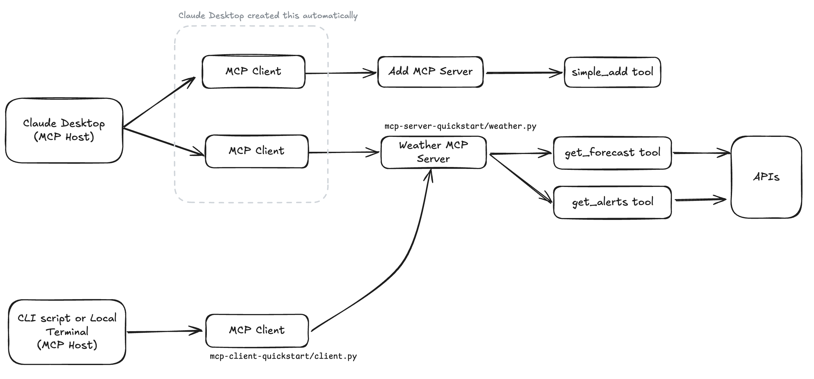
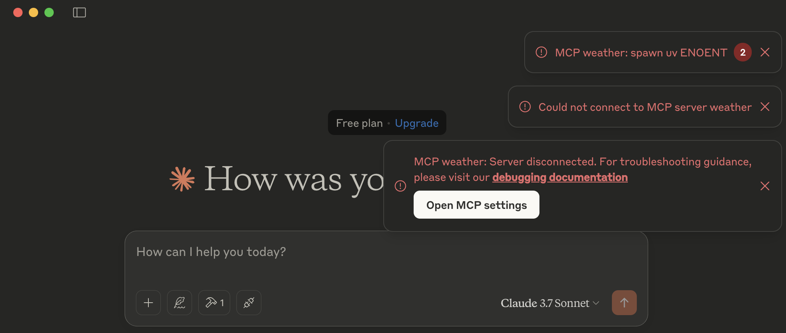
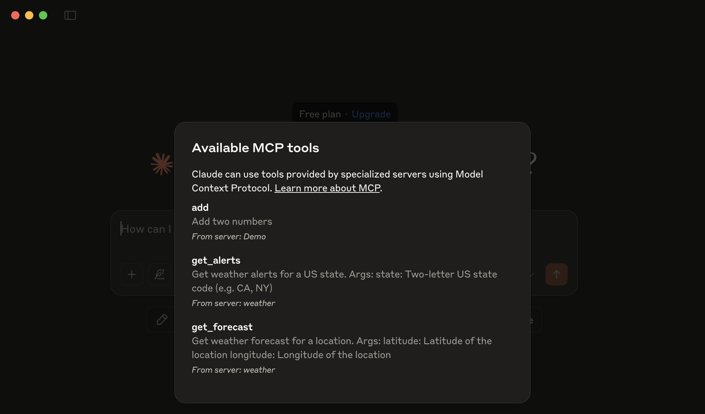
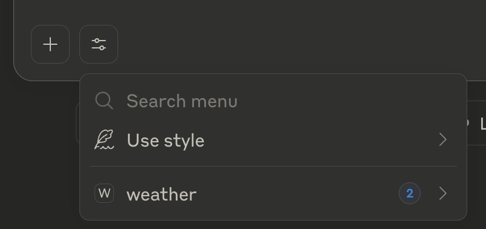

# MCP Client and MCP Server Quickstart

## References

- MCP Server: https://modelcontextprotocol.io/quickstart/server
- MCP Client: https://modelcontextprotocol.io/quickstart/client

## Result

### Running Weather MCP server using Claude Desktop as MCP Host

- note: Claude Desktop is an example of MCP Host that can automatically create MCP Clients based on the configuration file.





### Running Weather MCP Server using CLI as MCP Host and MCP Client that's created





## Learning Notes

### Notes

- MCP Client can developed both on the frontend side or on the backend side. In this example the MCP client are build using the Python backend.
- It's important to know the different between MCP Host and MCP Client
  - MCP host as 1 to n relationship to MCP Clients
  - MCP client has 1 to 1 relationship their respective MCP Server
- This is the diagram how different actors works

  

### Tips & Trics

- Use this to list mcp server
  ```bash
  ps aux | grep "weather.py" | grep -v grep
  ```
- example how to kill server
  ```bash
  kill 79200 79199
  ```
- how to open the claude config file
  ```bash
  code ~/Library/Application\ Support/Claude/claude_desktop_config.json
  ```
- If you are using virtual environment, make sure to do this

  ```bash
  # Create virtual environment and activate it
  uv venv
  source .venv/bin/activate

  # Install dependencies
  uv add "mcp[cli]" httpx
  ```

- make sure to install mcp server
  ```bash
  uv run mcp install main.py
  # change main.py to your entry filename
  ```
- How to resolve the issue of Claude Desktop kept on showing me error `"MCP <serverName>: spawn uv ENOENT"` and `"Could not connect MCP server <serverName>"`.

  

  1. identify uv location

     ```bash
     which uv
     # /Users/shafie/.local/bin/uv
     ```

  2. open the config file

     ```bash
     code ~/Library/Application\ Support/Claude/claude_desktop_config.json
     ```

  3. update the `"command": "uv"` to `"command": "/Users/shafie/.local/bin/uv"`

     for example, from this

     ```json
         "weather": {
           "command": "uv",
           "args": [
             "run",
             "--with",
             "mcp[cli]",
             "mcp",
             "run",
             "/Users/shafie/Documents/Github/mcp-server-weather/weather.py"
           ]
         }
     ```

     to this

     ```json
         "weather": {
           "command": "/Users/shafie/.local/bin/uv",
           "args": [
             "run",
             "--with",
             "mcp[cli]",
             "mcp",
             "run",
             "/Users/shafie/Documents/Github/mcp-server-weather/weather.py"
           ]
         }
     ```

  4. Restart Claude Desktop, no more errors, servers are added

     

     you will see this

     

- CLI I used to run the MCP Client and MCP server while inside the repo of the MCP Client.

  ```shell
  uv run client.py ../mcp-server-quickstart/weather.py
  ```
